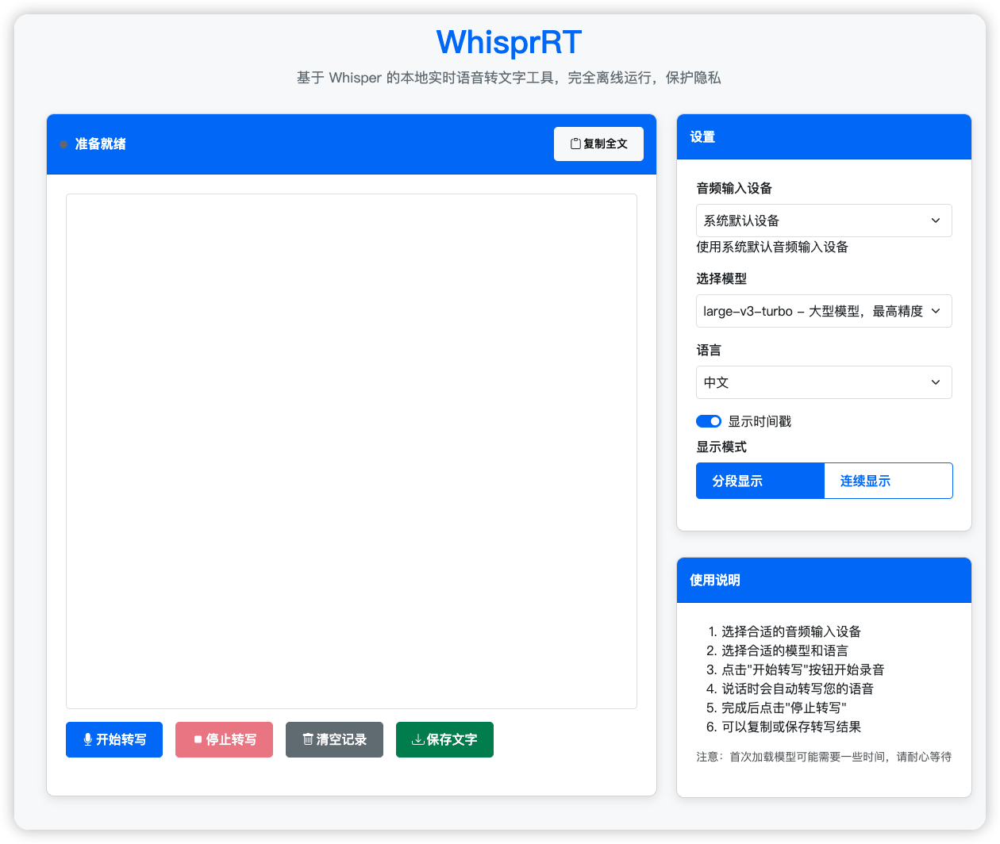

# WhisprRT

<p align="center">
  <a href="https://github.com/zhengjim/WhisprRT"></a>
  <a href="https://fastapi.tiangolo.com"></a>
  <a href="https://github.com/zhengjim/WhisprRT"></a>
  <a href="https://github.com/zhengjim/WhisprRT/blob/main/LICENSE"></a>
</p>

**WhisprRT** 是一个基于 [OpenAI Whisper](https://github.com/openai/whisper) 的本地实时语音转文字工具，支持完全离线运行。借助 FastAPI 提供轻量网页服务，快速、稳定、隐私安全，适用于会议记录、日常笔记、个人助手等多种场景。

---
## 前言

现在市面上的实时语音转文字工具，大多数都需要传音频来转(云端或本地)，实时语音转文字的，大多数都收费。免费的基本都会有时间或者次数限制，想一直用下去也挺麻烦的。

了解了下如何实现的，干脆自己做一个，完全本地离线跑，不上传音频、不用担心隐私问题，也没有时长限制，想用多久用多久。

## 功能亮点

- 🚀 **实时转写**：低延迟，快速将语音转为文字。
- 🔒 **100% 离线**：无需联网，数据不上传，隐私有保障。
- 🌐 **网页界面**：通过 FastAPI 提供简洁易用的前端。
- 🛡️ **反幻觉优化**：过滤，减少 large-v3-turbo 模型的幻觉内容。

---

## 程序截图



---
## 使用场景

- **会议纪要**：实时记录会议内容，高效整理。
- **个人笔记**：随时将灵感语音转为文字。
- **学习辅助**：转写讲座或课程，方便复习。
- **内容创作**：快速将口述内容转为文字草稿。

---

## 快速开始

### 前置要求

- **Python**：3.10 或更高版本
- **uv**：推荐的 Python 包管理工具（[安装指南](https://github.com/astral-sh/uv)）
- **操作系统**：Windows、MacOS 或 Linux

### 安装步骤

1. 克隆项目并进入目录：

   ```bash
   git clone https://github.com/zhengjim/WhisprRT.git
   cd WhisprRT
   ```

2. 安装依赖：

   ```bash
   uv sync
   ```

3. 激活虚拟环境：

   ```bash
   source .venv/bin/activate  # Linux/MacOS
   .venv\Scripts\activate     # Windows
   ```

4. 启动服务：

   ```bash
   uvicorn app.main:app --reload
   ```

5. 打开浏览器，访问：

   ```
   http://127.0.0.1:8000
   ```

> **注意**：建议仅在 `127.0.0.1` 运行，防止未经授权的访问。

### 推荐模型

默认使用 `large-v3-turbo` 模型，兼顾速度与准确性。性能较低的设备可切换其他模型（详见[模型选择](#模型选择)）。

---

## 使用示例

WhisprRT 使用示例

https://i.imgur.com/LbsAucR.gif

---

## 录制电脑音频

- **MacOS**：使用 [BlackHole](https://github.com/ExistentialAudio/BlackHole) 录制系统音频。
- **Windows**：使用 [VB-CABLE](https://vb-audio.com/Cable/) 录制系统音频。

详细教程参考 [Buzz 文档](https://chidiwilliams.github.io/buzz/zh/docs/usage/live_recording)。

---

## 模型选择

WhisprRT 默认使用 `large-v3-turbo` 模型，推荐优先使用。如果需要切换模型，可在配置文件中调整：

| 模型              | 性能要求 | 转写速度 | 准确性 |
|-------------------|----------|----------|--------|
| large-v3-turbo    | 中等     | 快       | 高     |
| medium            | 低       | 中       | 中     |
| small             | 极低     | 慢       | 低     |

> **提示**：实时转写对性能敏感，建议根据硬件选择合适的模型。

---

## 反幻觉功能

针对 `large-v3-turbo` 模型容易出现的幻觉问题（如重复广告文字："优优独播剧场"、"请不吝点赞"等），WhisprRT 内置了多层过滤机制：

### 🛡️ 核心优化

1. **参数调优**
   - 降低 `temperature` 至 0.0 减少随机性
   - 提高 `no_speech_threshold` 至 0.6 强化静音检测
   - 禁用 `condition_on_prev_tokens` 避免循环依赖

2. **智能过滤**
   - 内置 15+ 幻觉内容检测模式
   - 自动识别重复文本模式
   - 置信度门槛过滤低质量结果

3. **音频预处理**
   - 增强静音检测（能量+零交叉率+频谱分析）
   - 高通滤波去除低频噪音
   - 归一化处理提升识别准确性

### 🔧 参数调整

可通过 API 动态调整反幻觉参数：

```bash
# 获取当前配置
curl http://127.0.0.1:8000/anti_hallucination_config

# 更新参数
curl -X POST http://127.0.0.1:8000/update_anti_hallucination_config \
  -H "Content-Type: application/json" \
  -d '{"confidence_threshold": 0.7, "silence_threshold": 0.003}'

# 重置为默认值
curl -X POST http://127.0.0.1:8000/reset_anti_hallucination_config
```

### 🧪 测试验证

运行内置测试脚本验证反幻觉功能：

```bash
python test_anti_hallucination.py
```

测试内容包括：
- 幻觉内容检测准确性
- 音频预处理效果
- 转写质量验证
- API 配置功能

---

## 常见问题解答（FAQ）

### 1. WhisprRT 需要联网吗？
不需要，WhisprRT 100% 离线运行，音频数据不上传，保护隐私。

### 2. 如何选择适合的模型？
优先使用 `large-v3-turbo`，性能不足时可尝试 `medium` 或 `small` 模型。

### 3. 为什么转写速度慢？
可能原因：
- 硬件性能不足，尝试切换至更轻量模型。
- 未正确配置虚拟环境，确保依赖安装完整。

### 4. 支持哪些语言？
基于 Whisper，支持多语言转写，包括中文、英文、日文等。

### 5. 如何解决 large-v3-turbo 的幻觉问题？
WhisprRT 已内置反幻觉优化，如仍有问题可：
- 通过 API 提高 `confidence_threshold`（建议 0.7-0.8）
- 降低 `silence_threshold` 强化静音检测
- 添加自定义幻觉检测模式到配置文件

### 6. 如何自定义幻觉检测模式？
编辑 `app/config.py` 中的 `HALLUCINATION_PATTERNS` 列表，添加正则表达式模式：

```python
HALLUCINATION_PATTERNS = [
    r"优优独播剧场",
    r"你的自定义模式",
    # ... 更多模式
]
```

